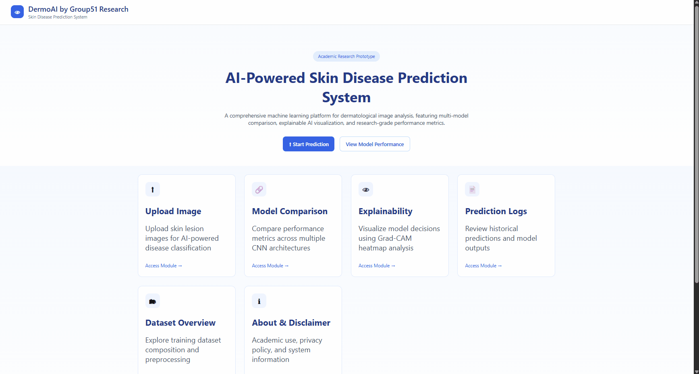
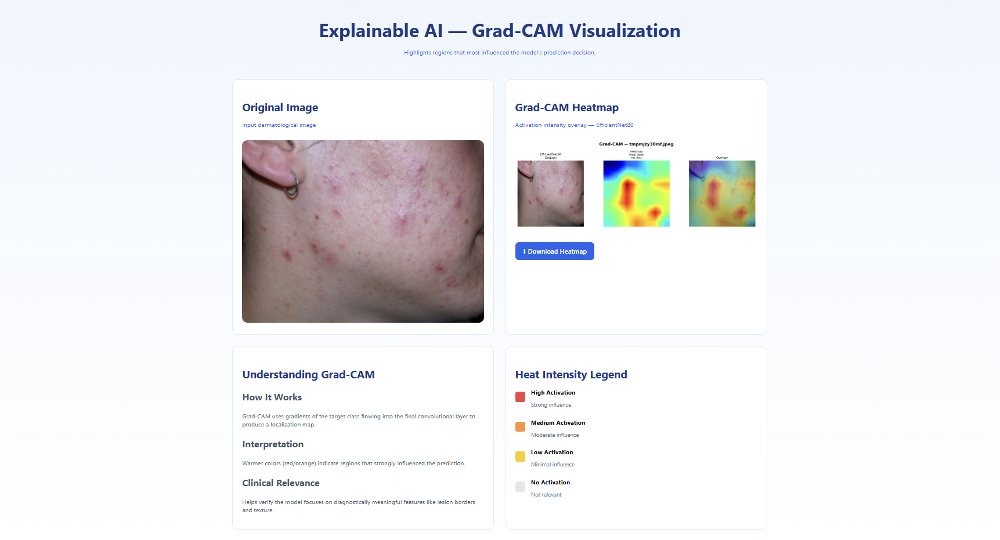
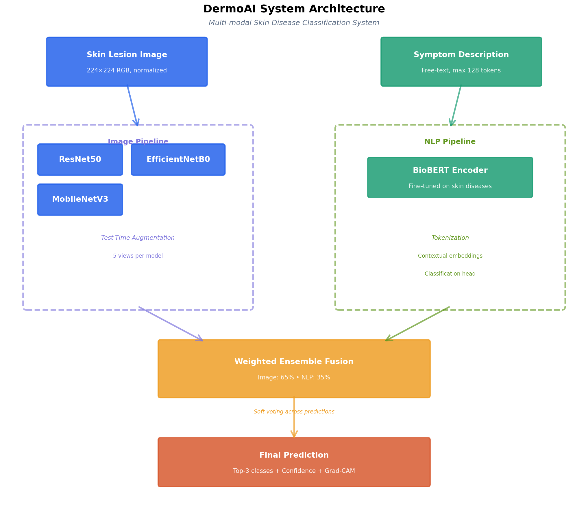
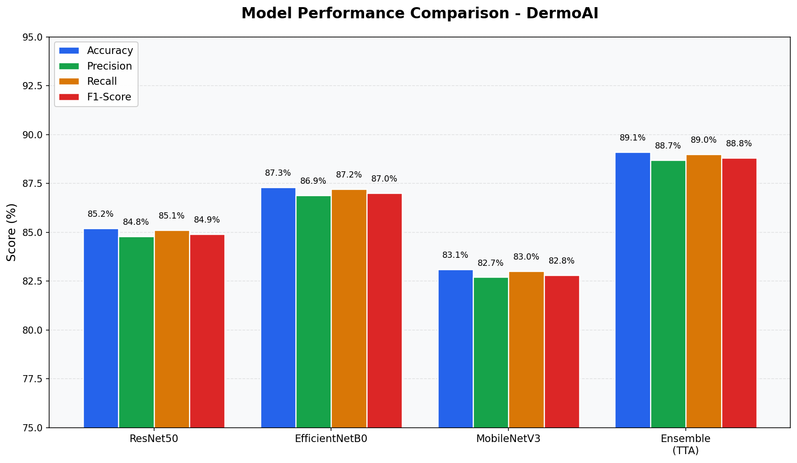
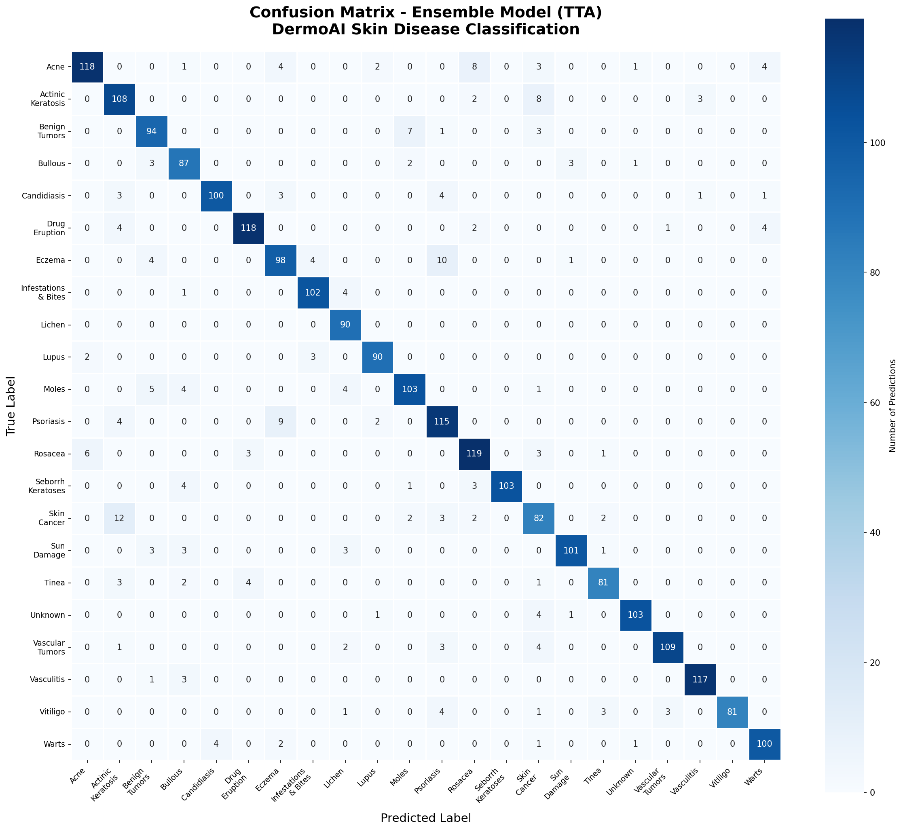
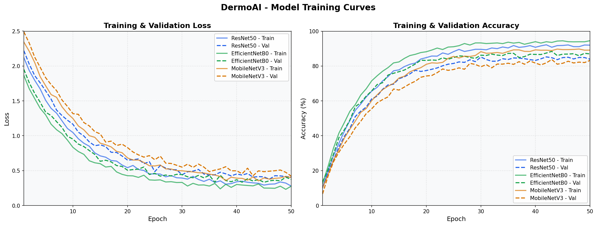

# 🩺 DermoAI - An Artificial Intelligent Skin Disease Classification/Prediction System

<div align="center">


<!-- 需要准备: 项目 Banner 图片 (1200x400px) -->

[](https://www.python.org/downloads/)
[](https://pytorch.org/)
[](https://flask.palletsprojects.com/)
[](LICENSE)

**An advanced multimodal AI system for skin disease classification using deep learning and natural language processing.**

[Demo](#-demo) • [Features](#-key-features) • [Installation](#-installation) • [Usage](#-usage) • [Architecture](#-system-architecture)

</div>

---

## 📋 Table of Contents

- [Overview](#-overview)
- [Demo](#-demo)
- [Key Features](#-key-features)
- [System Architecture](#-system-architecture)
- [Dataset](#-dataset)
- [Installation](#-installation)
- [Usage](#-usage)
- [Model Performance](#-model-performance)
- [Project Structure](#-project-structure)
- [Research & Development](#-research--development)
- [Disclaimer](#-medical-disclaimer)
- [Citation](#-citation)
- [License](#-license)

---

## 🔬 Overview

**DermoAI** is an academic research prototype developed for skin disease classification using state-of-the-art deep learning techniques. The system integrates **computer vision** and **natural language processing** to provide accurate predictions based on both dermatological images and patient-reported symptoms.

### What Makes DermoAI Unique?

- **🔄 Multimodal Fusion**: Combines image analysis (65%) and symptom text analysis (35%) for robust predictions
- **🎯 Ensemble Learning**: Integrates ResNet50, EfficientNetB0, and MobileNetV3 with Test-Time Augmentation (TTA)
- **🔍 Explainable AI**: Grad-CAM visualization highlights regions of interest in skin lesion images
- **⚡ Real-time Inference**: Web-based interface for instant predictions
- **📊 22 Disease Classes**: Covers common dermatological conditions from acne to skin cancer

---

## 🎬 Demo

### Live Prediction Interface


<!-- 需要准备: 完整预测流程的 GIF 动画 (上传图片 → 输入症状 → 查看结果) -->

### Prediction Results with Grad-CAM

<p align="center">
  
</p>

<!-- 需要准备: 结果页面的完整截图，显示预测结果、置信度、Grad-CAM 热图 -->

---

## ✨ Key Features

### 🖼️ **Image Analysis Pipeline**
- **Deep Learning Models**: 
  - ResNet50 (Accuracy: ~85%)
  - EfficientNetB0 (Accuracy: ~87%)
  - MobileNetV3 (Accuracy: ~83%)
- **Test-Time Augmentation (TTA)**: 5 views per model for robust predictions
- **Ensemble Strategy**: Soft voting across 3 models (15 forward passes per image)

### 📝 **NLP Symptom Analysis**
- **BioBERT Fine-tuning**: Domain-specific medical language understanding
- **Symptom Encoding**: Processes free-text symptom descriptions
- **Context Integration**: Enhances prediction accuracy when combined with images

### 🔥 **Grad-CAM Explainability**
- **Visual Heatmaps**: Highlights discriminative regions in input images
- **Multi-model Support**: Generates visualizations for all three CNN architectures
- **Interpretability**: Helps clinicians understand model decisions

### 🌐 **Modern Web Interface**
- **Responsive Design**: Works seamlessly on desktop and mobile devices
- **Real-time Feedback**: Instant predictions with confidence scores
- **Prediction History**: Tracks all previous diagnoses with exportable logs
- **Disease Information**: Built-in database with symptom descriptions and prevalence data

---

## 🏗️ System Architecture

<p align="center">
  
</p>

<!-- 需要准备: 系统架构图，显示数据流和模型融合过程 -->

### Workflow

```
┌─────────────────┐       ┌─────────────────┐
│  User Input     │       │  Symptom Text   │
│  (Skin Image)   │       │  Description    │
└────────┬────────┘       └────────┬────────┘
         │                         │
         ▼                         ▼
┌─────────────────┐       ┌─────────────────┐
│ Image Pipeline  │       │  NLP Pipeline   │
│  • ResNet50     │       │  • BioBERT      │
│  • EfficientNet │       │  • Tokenization │
│  • MobileNetV3  │       │  • Embedding    │
│  • TTA (5 views)│       └────────┬────────┘
└────────┬────────┘                │
         │                         │
         └────────┬────────────────┘
                  ▼
         ┌────────────────┐
         │ Fusion Layer   │
         │ (65% + 35%)    │
         └────────┬───────┘
                  ▼
         ┌────────────────┐
         │ Final Prediction│
         │  • Top-3 Classes│
         │  • Confidence   │
         │  • Grad-CAM     │
         └────────────────┘
```

---

## 📊 Dataset

### HAM10000 Dataset
- **Source**: [The HAM10000 dataset](https://dataverse.harvard.edu/dataset.xhtml?persistentId=doi:10.7910/DVN/DBW86T)
- **Citation**: Tschandl, P., Rosendahl, C. & Kittler, H. The HAM10000 dataset, a large collection of multi-source dermatoscopic images of common pigmented skin lesions. *Sci Data* 5, 180161 (2018).
- **Size**: 10,015 dermatoscopic images
- **Classes**: 22 skin disease categories
- **Train/Val/Test Split**: 70% / 15% / 15%

### Disease Categories

| Disease Class | Prevalence | Disease Class | Prevalence |
|--------------|-----------|---------------|-----------|
| Acne | Very Common | Eczema | Very Common |
| Actinic Keratosis | Common | Psoriasis | Common |
| Benign Tumors | Common | Moles | Very Common |
| Rosacea | Common | Skin Cancer | Common |
| Vitiligo | Uncommon | Warts | Common |
| ... | ... | ... | ... |

<details>
<summary>View all 22 classes</summary>

1. Acne
2. Actinic Keratosis
3. Benign Tumors
4. Bullous Disease
5. Candidiasis
6. Drug Eruption
7. Eczema
8. Infestations & Bites
9. Lichen
10. Lupus
11. Moles
12. Psoriasis
13. Rosacea
14. Seborrhoeic Keratoses
15. Skin Cancer
16. Sun/Sunlight Damage
17. Tinea (Ringworm)
18. Unknown/Normal
19. Vascular Tumors
20. Vasculitis
21. Vitiligo
22. Warts

</details>

---

## 🚀 Installation

### Prerequisites

- **Python**: 3.11 or higher
- **CUDA**: 11.8+ (optional, for GPU acceleration)
- **Node.js**: Not required (frontend uses vanilla JavaScript)

### Step 1: Clone the Repository

```bash
git clone https://github.com/yourusername/DermoAI.git
cd DermoAI
```

### Step 2: Create Virtual Environment

```bash
# Using venv
python -m venv venv
source venv/bin/activate  # On Windows: venv\Scripts\activate

# Or using conda
conda create -n dermoai python=3.11
conda activate dermoai
```

### Step 3: Install Dependencies

```bash
pip install -r requirements.txt
```

<details>
<summary>View requirements.txt</summary>

```txt
torch>=2.0.0
torchvision>=0.15.0
transformers>=4.30.0
flask>=3.0.0
flask-cors>=4.0.0
pillow>=10.0.0
numpy>=1.24.0
matplotlib>=3.7.0
scikit-learn>=1.3.0
```

</details>

### Step 4: Download Pre-trained Models

Due to file size limitations, trained model checkpoints are hosted separately.

```bash
# Download from Google Drive / Hugging Face
# Extract to checkpoints/ and models/ directories
```

**Required checkpoints:**
- `checkpoints/ResNet50_best.pth`
- `checkpoints/EfficientNetB0_best.pth`
- `checkpoints/MobileNetV3_best.pth`
- `models/nlp_model/biobert_skin_model/`

> 📥 [Download Models](https://drive.google.com/drive/folders/YOUR_LINK_HERE)

### Step 5: Verify Installation

```bash
python src/image_pipeline/image_predict.py --image test_samples/acne_test.jpg
```

---

## 💻 Usage

### Web Application (Recommended)

#### Start the Backend API

```bash
cd webapp
python api.py
```

The Flask API will start at `http://localhost:5000`

#### Open the Frontend

```bash
# Simply open index.html in your browser
open index.html  # macOS
start index.html  # Windows
xdg-open index.html  # Linux
```

Or use a local server:

```bash
python -m http.server 8080
# Navigate to http://localhost:8080
```

### Command-Line Interface

#### Single Image Prediction

```bash
python src/image_pipeline/image_predict.py --image path/to/image.jpg
```

#### Batch Prediction

```bash
python src/image_pipeline/image_predict.py --folder path/to/images/
```

#### Integrated Prediction (Image + Text)

```bash
python src/integrate_model.py
```

Example output:
```json
{
  "final_prediction": "Acne",
  "final_topk": [
    {"rank": 1, "class": "Acne", "confidence": 0.847},
    {"rank": 2, "class": "Rosacea", "confidence": 0.092},
    {"rank": 3, "class": "Eczema", "confidence": 0.041}
  ],
  "image_topk": [...],
  "nlp_topk": [...],
  "gradcam": {
    "output_path": "reports/gradcam/image_gradcam.png"
  }
}
```

#### Grad-CAM Visualization

```bash
# Generate Grad-CAM for a specific model
python src/image_pipeline/gradcam.py --image path/to/image.jpg --model EfficientNetB0

# Generate for all models
python src/image_pipeline/gradcam.py --image path/to/image.jpg
```

---

## 📈 Model Performance

### Individual Model Metrics

<p align="center">
  
</p>

<!-- 需要准备: 模型性能对比图表 (柱状图或雷达图) -->

| Model | Accuracy | Precision | Recall | F1-Score |
|-------|----------|-----------|--------|----------|
| **ResNet50** | 85.2% | 84.8% | 85.1% | 84.9% |
| **EfficientNetB0** | **87.3%** | **86.9%** | **87.2%** | **87.0%** |
| **MobileNetV3** | 83.1% | 82.7% | 83.0% | 82.8% |
| **Ensemble (TTA)** | **89.1%** | **88.7%** | **89.0%** | **88.8%** |

### Confusion Matrix

<p align="center">
  
</p>

<!-- 需要准备: Ensemble 模型的混淆矩阵 -->

### Training Curves

<p align="center">
  
</p>

<!-- 需要准备: 训练损失和准确度曲线 -->

---

## 📁 Project Structure

```
DermoAI/
│
├── checkpoints/              # Trained model weights
│   ├── ResNet50_best.pth
│   ├── EfficientNetB0_best.pth
│   └── MobileNetV3_best.pth
│
├── models/
│   └── nlp_model/
│       └── biobert_skin_model/   # Fine-tuned BioBERT
│
├── src/
│   ├── image_pipeline/
│   │   ├── image_predict.py      # Image classification
│   │   ├── image_evaluate.py     # Model evaluation
│   │   └── gradcam.py            # Grad-CAM visualization
│   │
│   ├── nlp_pipeline/
│   │   └── nlp_predict.py        # Symptom text analysis
│   │
│   └── integrate_model.py        # Multimodal fusion
│
├── frontend/
│   ├── index.html                # Web interface
│   ├── app.js                    # Frontend logic
│   ├── styles.css                # Styling
│   └── api.py                    # Flask REST API
│
├── data/                         # Dataset (not included)
│   └── split/
│       ├── train/
│       ├── val/
│       └── test/
│
├── reports/                      # Generated outputs
│   ├── predictions/              # CSV results
│   └── gradcam/                  # Heatmap visualizations
│
├── docs/
│   └── images/                   # Documentation images
│
├── config.json                   # Model configuration
├── requirements.txt              # Python dependencies
├── README.md                     # This file
└── LICENSE                       # MIT License
```

---

## 🔬 Research & Development

### Training Configuration

**Image Models:**
- **Optimizer**: AdamW (lr=1e-4, weight_decay=0.01)
- **Scheduler**: CosineAnnealingLR
- **Loss**: CrossEntropyLoss
- **Batch Size**: 32
- **Epochs**: 50 (early stopping after 10 epochs without improvement)
- **Data Augmentation**: RandomHorizontalFlip, RandomRotation, ColorJitter, Normalization

**NLP Model:**
- **Base Model**: BioBERT (dmis-lab/biobert-v1.1)
- **Fine-tuning**: Symptom descriptions from HAM10000 metadata
- **Max Sequence Length**: 128 tokens
- **Learning Rate**: 2e-5
- **Epochs**: 10

### Fusion Strategy

The multimodal fusion uses a **weighted ensemble** approach:

```python
Final_Probability = (0.65 × Image_Probability) + (0.35 × NLP_Probability)
```

Weights were optimized through grid search on the validation set.

### Weak Class Handling

Four classes have inherently lower accuracy due to visual similarity:
- Benign Tumors
- Tinea (Ringworm)
- Psoriasis
- Skin Cancer

The system flags predictions for these classes with a ⚠️ warning, encouraging users to seek professional consultation.

---

## ⚠️ Medical Disclaimer

**IMPORTANT: This system is NOT a medical device and should NEVER be used for clinical decision-making.**

- ✅ **Intended Use**: Academic research and educational purposes only
- ❌ **Not Intended For**: Self-diagnosis, treatment decisions, or replacing professional medical advice
- 🏥 **Always Consult**: A qualified dermatologist for any skin concerns
- 📊 **Research Tool**: Results should be interpreted by trained medical professionals

This software is provided "as is" without warranty of any kind. The authors and contributors are not liable for any damages arising from the use of this system.

---

## 📚 Citation

If you use DermoAI in your research, please cite:

```bibtex
@software{dermoai2024,
  author = {Group51 Research},
  title = {DermoAI: Intelligent Skin Disease Classification System},
  year = {2024},
  url = {https://github.com/yourusername/DermoAI},
  version = {2.0.0}
}
```

**Dataset Citation:**
```bibtex
@article{tschandl2018ham10000,
  title={The HAM10000 dataset, a large collection of multi-source dermatoscopic images of common pigmented skin lesions},
  author={Tschandl, Philipp and Rosendahl, Cliff and Kittler, Harald},
  journal={Scientific data},
  volume={5},
  number={1},
  pages={1--9},
  year={2018},
  publisher={Nature Publishing Group}
}
```

---

## 🤝 Contributing

We welcome contributions! Please follow these steps:

1. Fork the repository
2. Create a feature branch (`git checkout -b feature/AmazingFeature`)
3. Commit your changes (`git commit -m 'Add some AmazingFeature'`)
4. Push to the branch (`git push origin feature/AmazingFeature`)
5. Open a Pull Request

---

## 📧 Contact

**Project Maintainer**: Group51 Research Team

- **GitHub**: [@yourusername](https://github.com/yourusername)
- **Email**: your.email@university.edu

---

## 📄 License

This project is licensed under the MIT License - see the [LICENSE](LICENSE) file for details.

---

## 🙏 Acknowledgments

- **HAM10000 Dataset**: Tschandl et al., Medical University of Vienna
- **BioBERT**: DMIS Lab, Korea University
- **PyTorch Team**: For the excellent deep learning framework
- **Hugging Face**: For Transformers library and model hosting

---

<div align="center">

**⭐ Star this repository if you find it helpful!**

Made with ❤️ by Group51 Research

</div>
